# 分布式消息中间件统一接入组件设计

## 1. 架构设计图

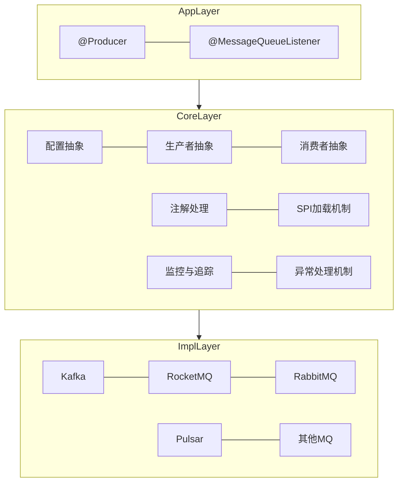

## 2. 关键接口的UML类图

### 2.1 配置类接口设计

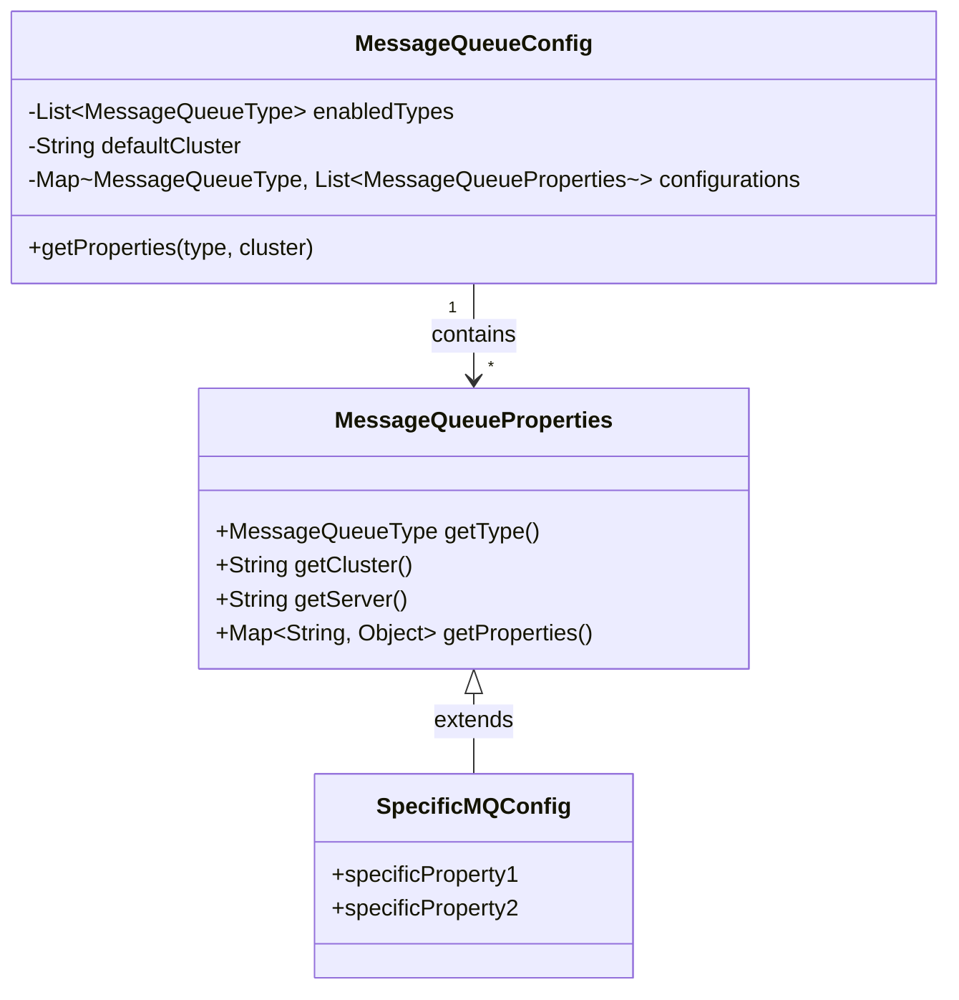

### 2.2 生产者接口设计

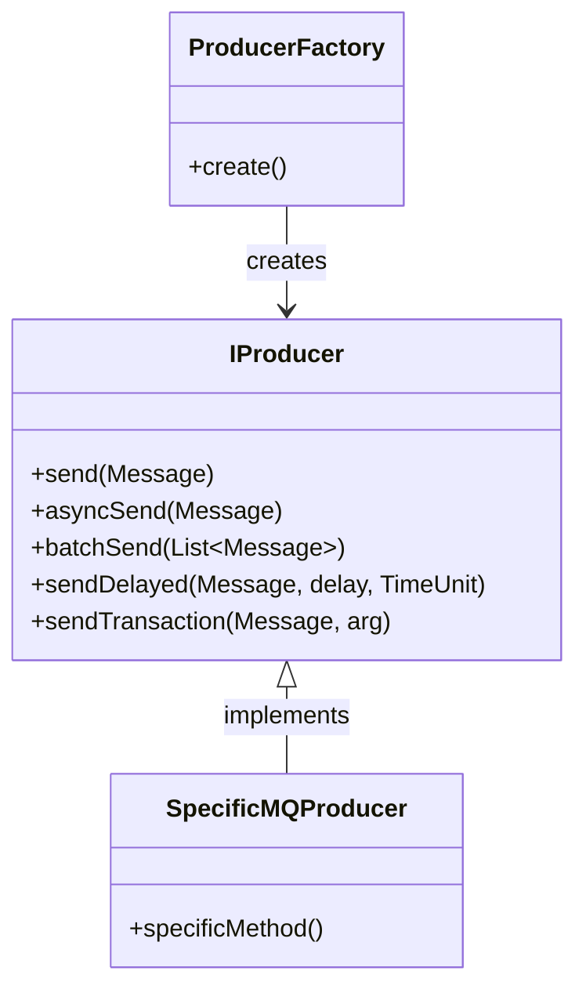

### 2.3 消费者接口设计

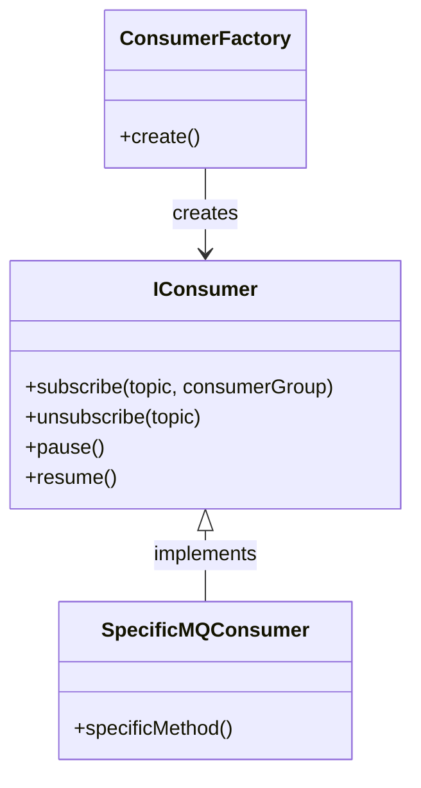

### 2.4 注解处理器设计

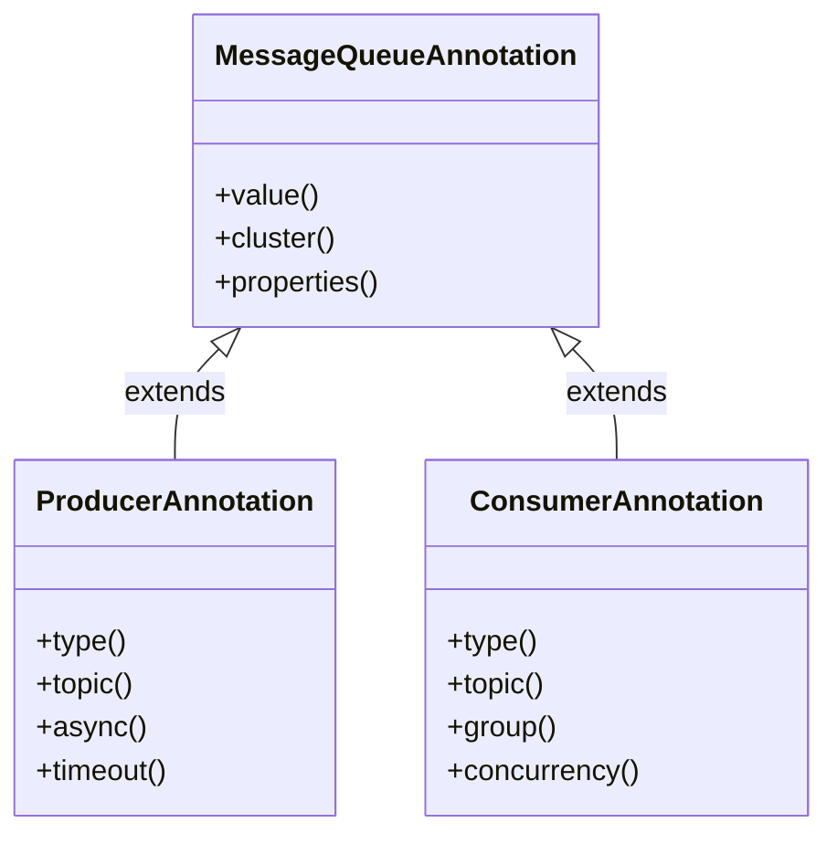

## 3. 注解/接口处理流程的时序图

### 3.1 生产者注解处理流程

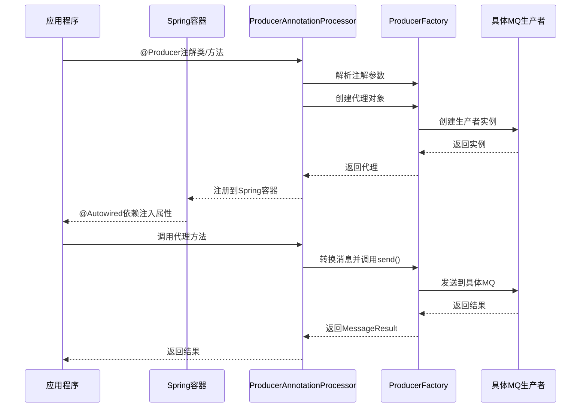

### 3.2 消费者注解处理流程

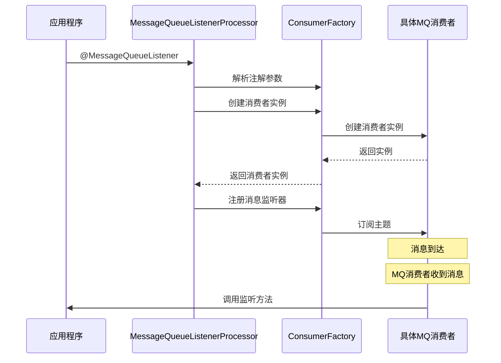

## 4. 配置加载机制的实现策略

### 4.1 配置加载流程

1. **配置来源识别**
    - YAML/Properties配置文件解析
    - 环境变量配置
    - 系统属性配置
    - 注解配置

2. **配置合并策略**
    - 优先级: 注解配置 > 环境变量 > 配置文件 > 默认配置
    - 不同级别配置属性合并

3. **配置动态更新机制**
    - 配置变更监听器
    - 配置变更事件通知
    - 消息队列客户端热重载

### 4.2 配置处理流程

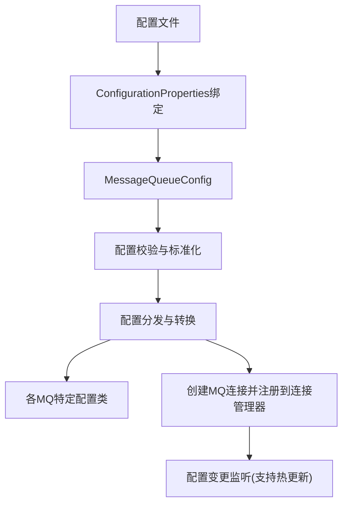

## 5. 消息路由的异常处理方案

### 5.1 异常层次结构

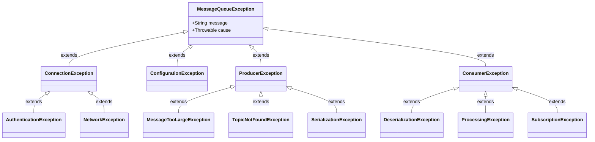

### 5.2 异常处理策略

1. **生产者异常处理**
    - 重试机制: 指数退避算法
    - 熔断机制: 错误率阈值触发
    - 降级策略: 本地缓存或备用MQ

2. **消费者异常处理**
    - 死信队列处理
    - 重试队列与重试次数限制
    - 消费者隔离与恢复机制

3. **监控与告警**
    - 异常事件监控
    - 关键指标阈值告警
    - 错误日志聚合分析

## 6. 跨MQ协议的事务协调方案

### 6.1 两阶段提交协议适配

针对支持事务的MQ实现(如RocketMQ、Kafka transactions)提供两阶段提交协议封装:

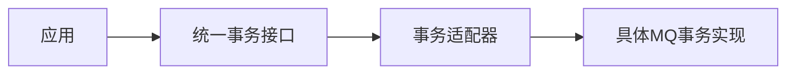

### 6.2 基于补偿的最终一致性方案

对于不支持事务的MQ，提供基于补偿的最终一致性实现:

1. 事务操作记录持久化
2. 消息发送状态跟踪
3. 定时重试或人工干预接口
4. 补偿操作日志记录

## 7. 包/模块分层结构

```mermaid
graph TD
   Root["Parent模块"] --> Core["core - 核心模块"]
   Root --> Support["support - 通用模块"]
   Root --> Spring["spring - Spring集成模块"]
   Root --> Impl["消息队列子模块 - 具体消息队列实现"]

   Core --> Annotation["annotation - 注解定义"]
   Core --> Config["config - 配置抽象"]
   Core --> Producer["producer - 生产者抽象"]
   Core --> Consumer["consumer - 消费者抽象"]
   Core --> Message["message - 消息抽象"]
   Core --> Exception["exception - 异常体系"]
   Core --> Metrics["metrics - 监控抽象"]

   Support --> Converter["converter - 消息转换"]
   Support --> Serializer["serializer - 序列化器"]
   Support --> Retry["retry - 重试机制"]
   Support --> Util["util - 工具类"]

   Spring --> SpringAnnotation["annotation - 注解处理器"]
   Spring --> SpringConfig["config - 自动配置"]
   Spring --> Factory["factory - Bean工厂"]

   Impl --> Kafka["kafka - Kafka实现"]
   Impl --> RocketMQ["rocketmq - RocketMQ实现"]
   Impl --> RabbitMQ["rabbitmq - RabbitMQ实现"]
   Impl --> Pulsar["pulsar - Pulsar实现"]
```

```markdown
    ├── message-queue-core
    │   ├── annotation (注解体系：@Producer/@MessageQueueListener/@Producers/@MessageQueueListeners)
    │   ├── config (配置规范：MessageQueueConfig/BaseMessageQueueProperties/MessageQueueProperties)
    │   ├── consumer (生产者接口：IConsumer/MessageListener)
    │   ├── container (消息监听容器)
    │   ├── enums (枚举值)
    │   ├── exception (异常系统)
    │   ├── factory (工厂模块)
    │   ├── message (消息体)
    │   └── producer (生产者接口：IProducer/AbstractProducer)
    ├── message-queue-support
    │   ├── converter (消息转换器)
    │   ├── retry (重试模块)
    │   ├── serializer (序列化类)
    │   ├── util (工具类)
    │   └── ...
    ├── message-queue-spring-starter
    │   ├── config (自动配置)
    │   ├── processor (注解处理器)
    │   └── ...
    └── message-queue-xxx-impl (各MQ实现模块)
        └── xxx (具体实现类)
```

## 8. 详细代码实现设计

### 8.1 核心配置接口

```java
/**
 * 消息队列类型枚举
 */
public enum MessageQueueType {
   KAFKA,
   ROCKETMQ,
   RABBITMQ,
   PULSAR
}

/**
 * 消息队列通用配置接口
 */
public interface MessageQueueProperties {
   MessageQueueType getType();
   String getCluster();
   String getServer();
   Map<String, Object> getProperties();
}

/**
 * 消息队列配置类
 */
@ConfigurationProperties(prefix = "message-queue")
public class MessageQueueConfig {
   private List<MessageQueueType> enabledTypes;
   private String defaultCluster;
   private Map<MessageQueueType, List<MessageQueueProperties>> configurations;

   // 根据类型和集群获取配置
   public MessageQueueProperties getProperties(MessageQueueType type, String cluster) {
      // 实现配置查找逻辑
   }
}
```

### 8.2 生产者接口设计

```java
/**
 * 消息发送结果
 */
public interface SendResult {
   String getMessageId();
   boolean isSuccess();
   Throwable getException();
   Object getRawResult(); // 原生MQ的结果对象
}

/**
 * 统一消息对象
 */
public class Message {
   private String topic;
   private String key;
   private Object payload;
   private Map<String, String> headers;
   private long delayTime;
   // getter/setter
}

/**
 * 生产者接口
 */
public interface IProducer {
   SendResult send(Message message);
   CompletableFuture<SendResult> asyncSend(Message message);
   List<SendResult> batchSend(List<Message> messages);
   SendResult sendDelayed(Message message, long delay, TimeUnit unit);
   SendResult sendTransaction(Message message, Object arg);
   void commit(String transactionId);
   void rollback(String transactionId);
}

/**
 * 生产者注解
 */
@Target({ElementType.TYPE, ElementType.METHOD})
@Retention(RetentionPolicy.RUNTIME)
@Documented
public @interface Producer {
   MessageQueueType type() default MessageQueueType.KAFKA;
   String cluster() default "";
   String topic();
   boolean async() default false;
   long timeout() default 3000L;
   // 其他属性
}
```

### 8.3 消费者接口设计

```java
/**
 * 消费者接口
 */
public interface IConsumer {
   void subscribe(String topic, String consumerGroup);
   void unsubscribe(String topic);
   void pause();
   void resume();
   void close();
}

/**
 * 消费者监听注解
 */
@Target({ElementType.TYPE, ElementType.METHOD})
@Retention(RetentionPolicy.RUNTIME)
@Documented
public @interface MessageQueueListener {
   MessageQueueType type() default MessageQueueType.KAFKA;
   String cluster() default "";
   String topic();
   String group();
   int concurrency() default 1;
   // 其他属性
}
```

### 8.4 注解处理器实现

```java
/**
 * Producer注解处理器
 */
@Component
public class ProducerAnnotationProcessor implements BeanPostProcessor {
   @Override
   public Object postProcessAfterInitialization(Object bean, String beanName) throws BeansException {
      Class<?> clazz = AopUtils.getTargetClass(bean);

      // 处理类上的注解
      if (clazz.isAnnotationPresent(Producer.class)) {
         // 创建代理对象
      }

      // 处理方法上的注解
      for (Method method : clazz.getDeclaredMethods()) {
         if (method.isAnnotationPresent(Producer.class)) {
            // 创建方法代理
         }
      }

      return bean;
   }
}

/**
 * MessageQueueListener注解处理器
 */
@Component
public class MessageQueueListenerProcessor implements BeanPostProcessor {
   @Override
   public Object postProcessAfterInitialization(Object bean, String beanName) throws BeansException {
      Class<?> clazz = AopUtils.getTargetClass(bean);

      // 处理类上的注解
      if (clazz.isAnnotationPresent(MessageQueueListener.class)) {
         // 创建消费者并注册监听器
      }

      // 处理方法上的注解
      for (Method method : clazz.getDeclaredMethods()) {
         if (method.isAnnotationPresent(MessageQueueListener.class)) {
            // 创建方法监听器
         }
      }

      return bean;
   }
}
```

### 8.5 SPI扩展机制设计

```java
/**
 * 生产者工厂SPI接口
 */
public interface ProducerFactory {
   boolean supports(MessageQueueType type);
   IProducer createProducer(MessageQueueProperties properties);
}

/**
 * 消费者工厂SPI接口
 */
public interface ConsumerFactory {
   boolean supports(MessageQueueType type);
   IConsumer createConsumer(MessageQueueProperties properties);
}

/**
 * SPI加载器
 */
public class MessageQueueExtensionLoader {
   public <T> T getExtension(Class<T> type, MessageQueueType mqType) {
      // 使用ServiceLoader加载SPI实现
      ServiceLoader<T> loader = ServiceLoader.load(type);
      for (T extension : loader) {
         if (((Supports)extension).supports(mqType)) {
            return extension;
         }
      }
      throw new IllegalArgumentException("No extension found for " + type.getName() + " with type " + mqType);
   }
}
```

### 8.6 监控与追踪设计

```java
/**
 * 消息追踪接口
 */
public interface MessageTracer {
   void traceProducerStart(Message message);
   void traceProducerEnd(Message message, SendResult result);
   void traceConsumerStart(Message message, String consumerGroup);
   void traceConsumerEnd(Message message, String consumerGroup, boolean success);
}

/**
 * 监控指标收集器
 */
public interface MetricsCollector {
   void recordSendLatency(MessageQueueType type, String topic, long latencyMs);
   void recordSendSuccess(MessageQueueType type, String topic);
   void recordSendFailure(MessageQueueType type, String topic, Throwable error);
   void recordConsumeLatency(MessageQueueType type, String topic, String group, long latencyMs);
   void recordConsumeSuccess(MessageQueueType type, String topic, String group);
   void recordConsumeFailure(MessageQueueType type, String topic, String group, Throwable error);
}
```

## 9. 性能优化设计

### 9.1 生产者性能优化

1. **连接池化**
    - 预创建连接池
    - 智能连接管理

2. **批处理优化**
    - 自适应批量发送
    - 消息合并策略

3. **序列化优化**
    - 高性能序列化框架
    - 对象池复用

4. **线程模型**
    - 多线程发送队列
    - 业务线程与IO线程分离

### 9.2 消费者性能优化

1. **并发消费**
    - 动态线程池
    - 分区/队列级并行

2. **背压机制**
    - 消费速率控制
    - 缓冲区管理

3. **批量确认**
    - 聚合确认机制
    - 定时批量提交

4. **预取优化**
    - 自适应预取数量
    - 消费者负载均衡 