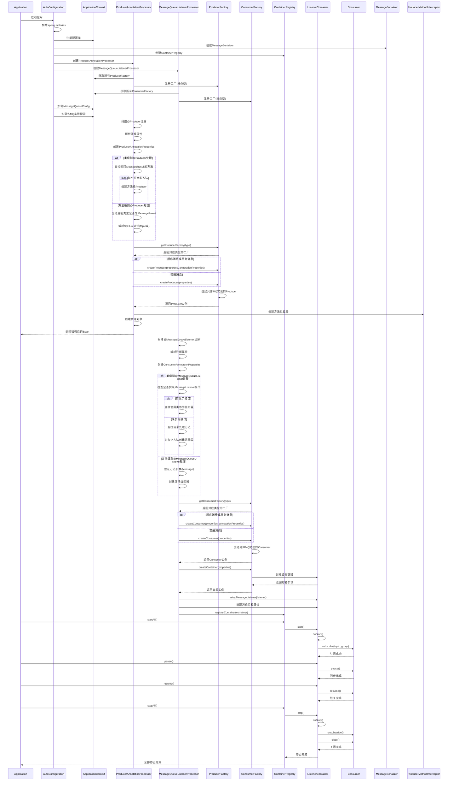
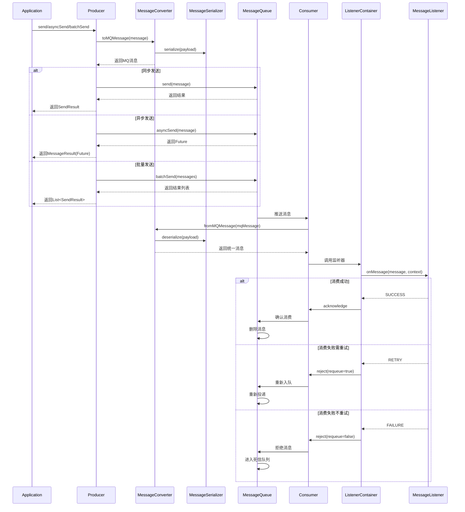
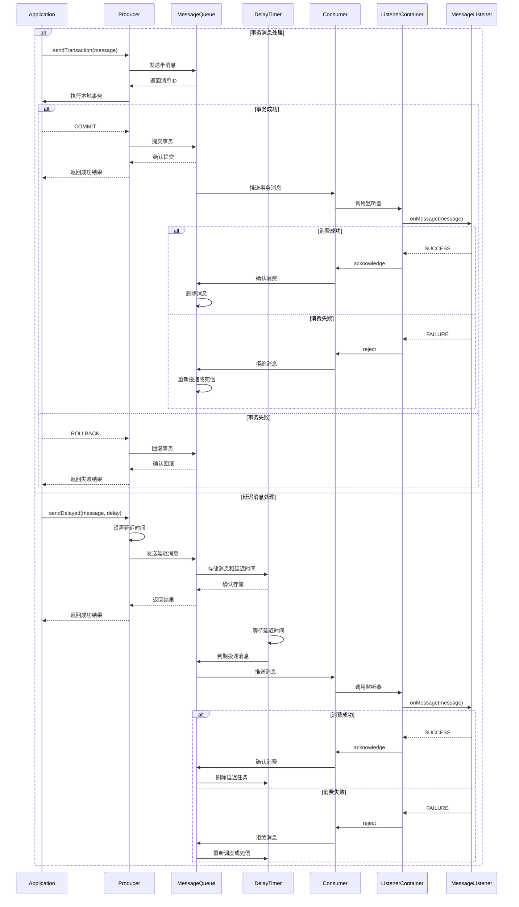

# 消息队列项目流转图

## Spring Boot自动配置和生命周期流程图

```mermaid
sequenceDiagram
    participant App as Application
    participant AC as AutoConfiguration
    participant Ctx as ApplicationContext
    participant PAP as ProducerAnnotationProcessor
    participant MLP as MessageQueueListenerProcessor
    participant PF as ProducerFactory
    participant CF as ConsumerFactory
    participant LCR as ContainerRegistry
    participant LC as ListenerContainer
    participant C as Consumer
    participant MS as MessageSerializer
    participant PMI as ProducerMethodInterceptor

    %% Spring Boot启动流程
    App->>AC: 启动应用
    AC->>AC: 加载spring.factories
    AC->>Ctx: 注册配置类
    
    %% 组件初始化
    AC->>MS: 创建MessageSerializer
    AC->>LCR: 创建ContainerRegistry
    AC->>PAP: 创建ProducerAnnotationProcessor
    AC->>MLP: 创建MessageQueueListenerProcessor
    
    %% 工厂初始化
    PAP->>Ctx: 获取所有ProducerFactory
    PAP->>PF: 注册工厂(按类型)
    MLP->>Ctx: 获取所有ConsumerFactory
    MLP->>CF: 注册工厂(按类型)
    
    %% 配置加载
    AC->>Ctx: 加载MessageQueueConfig
    AC->>Ctx: 加载各MQ实现配置
    
    %% 生产者注解处理详细流程
    PAP->>PAP: 扫描@Producer注解
    PAP->>PAP: 解析注解属性
    PAP->>PAP: 创建ProducerAnnotationProperties
    
    alt 类级别@Producer处理
        PAP->>PAP: 查找返回MessageResult的方法
        loop 每个符合的方法
            PAP->>PAP: 创建方法级Producer
        end
    else 方法级别@Producer处理
        PAP->>PAP: 验证返回类型是否为MessageResult
        PAP->>PAP: 解析SpEL表达式(topic等)
    end
    
    PAP->>PF: getProducerFactory(type)
    PF-->>PAP: 返回对应类型的工厂
    
    alt 顺序消息或事务消息
        PAP->>PF: createProducer(properties, annotationProperties)
    else 普通消息
        PAP->>PF: createProducer(properties)
    end
    
    PF->>PF: 创建具体MQ实现的Producer
    PF-->>PAP: 返回Producer实例
    
    PAP->>PMI: 创建方法拦截器
    PAP->>PAP: 创建代理对象
    PAP-->>App: 返回增强后的Bean
    
    %% 消费者注解处理详细流程
    MLP->>MLP: 扫描@MessageQueueListener注解
    MLP->>MLP: 解析注解属性
    MLP->>MLP: 创建ConsumerAnnotationProperties
    
    alt 类级别@MessageQueueListener处理
        MLP->>MLP: 检查是否实现MessageListener接口
        alt 实现了接口
            MLP->>MLP: 直接使用类作为监听器
        else 未实现接口
            MLP->>MLP: 查找消息处理方法
            MLP->>MLP: 为每个方法创建适配器
        end
    else 方法级别@MessageQueueListener处理
        MLP->>MLP: 验证方法参数(Message)
        MLP->>MLP: 创建方法适配器
    end
    
    MLP->>CF: getConsumerFactory(type)
    CF-->>MLP: 返回对应类型的工厂
    
    alt 顺序消费或事务消费
        MLP->>CF: createConsumer(properties, annotationProperties)
    else 普通消费
        MLP->>CF: createConsumer(properties)
    end
    
    CF->>CF: 创建具体MQ实现的Consumer
    CF-->>MLP: 返回Consumer实例
    
    MLP->>CF: createContainer(properties)
    CF->>LC: 创建监听容器
    LC-->>CF: 返回容器实例
    CF-->>MLP: 返回容器实例
    
    MLP->>LC: setupMessageListener(listener)
    MLP->>LC: 设置消费者和属性
    MLP->>LCR: registerContainer(container)
    
    %% 容器生命周期管理
    App->>LCR: startAll()
    LCR->>LC: start()
    LC->>LC: doStart()
    LC->>C: subscribe(topic, group)
    C-->>LC: 订阅成功
    
    %% 容器暂停/恢复
    App->>LC: pause()
    LC->>C: pause()
    C-->>LC: 暂停完成
    App->>LC: resume()
    LC->>C: resume()
    C-->>LC: 恢复完成
    
    %% 容器停止
    App->>LCR: stopAll()
    LCR->>LC: stop()
    LC->>LC: doStop()
    LC->>C: unsubscribe()
    LC->>C: close()
    C-->>LC: 关闭完成
    LC-->>LCR: 停止完成
    LCR-->>App: 全部停止完成
```

## 消息生产消费流程图

```mermaid
sequenceDiagram
    participant App as Application
    participant P as Producer
    participant MC as MessageConverter
    participant MS as MessageSerializer
    participant MQ as MessageQueue
    participant C as Consumer
    participant LC as ListenerContainer
    participant L as MessageListener

    %% 消息发送流程
    App->>P: send/asyncSend/batchSend
    P->>MC: toMQMessage(message)
    MC->>MS: serialize(payload)
    MC-->>P: 返回MQ消息
    
    alt 同步发送
        P->>MQ: send(message)
        MQ-->>P: 返回结果
        P-->>App: 返回SendResult
    else 异步发送
        P->>MQ: asyncSend(message)
        MQ-->>P: 返回Future
        P-->>App: 返回MessageResult(Future)
    else 批量发送
        P->>MQ: batchSend(messages)
        MQ-->>P: 返回结果列表
        P-->>App: 返回List<SendResult>
    end

    %% 消息消费流程
    MQ->>C: 推送消息
    C->>MC: fromMQMessage(mqMessage)
    MC->>MS: deserialize(payload)
    MC-->>C: 返回统一消息
    C->>LC: 调用监听器
    LC->>L: onMessage(message, context)
    
    alt 消费成功
        L-->>LC: SUCCESS
        LC->>C: acknowledge
        C->>MQ: 确认消费
        MQ->>MQ: 删除消息
    else 消费失败需重试
        L-->>LC: RETRY
        LC->>C: reject(requeue=true)
        C->>MQ: 重新入队
        MQ->>MQ: 重新投递
    else 消费失败不重试
        L-->>LC: FAILURE
        LC->>C: reject(requeue=false)
        C->>MQ: 拒绝消息
        MQ->>MQ: 进入死信队列
    end
```

## 事务和延迟消息处理流程图

```mermaid
sequenceDiagram
    participant App as Application
    participant P as Producer
    participant MQ as MessageQueue
    participant Timer as DelayTimer
    participant C as Consumer
    participant LC as ListenerContainer
    participant L as MessageListener

    alt 事务消息处理
        %% 事务消息发送
        App->>P: sendTransaction(message)
        P->>MQ: 发送半消息
        MQ-->>P: 返回消息ID
        P->>App: 执行本地事务
        
        alt 事务成功
            App-->>P: COMMIT
            P->>MQ: 提交事务
            MQ-->>P: 确认提交
            P-->>App: 返回成功结果
            
            %% 事务消息消费
            MQ->>C: 推送事务消息
            C->>LC: 调用监听器
            LC->>L: onMessage(message)
            alt 消费成功
                L-->>LC: SUCCESS
                LC->>C: acknowledge
                C->>MQ: 确认消费
                MQ->>MQ: 删除消息
            else 消费失败
                L-->>LC: FAILURE
                LC->>C: reject
                C->>MQ: 拒绝消息
                MQ->>MQ: 重新投递或死信
            end
        else 事务失败
            App-->>P: ROLLBACK
            P->>MQ: 回滚事务
            MQ-->>P: 确认回滚
            P-->>App: 返回失败结果
        end
    else 延迟消息处理
        %% 延迟消息发送
        App->>P: sendDelayed(message, delay)
        P->>P: 设置延迟时间
        P->>MQ: 发送延迟消息
        MQ->>Timer: 存储消息和延迟时间
        Timer-->>MQ: 确认存储
        MQ-->>P: 返回结果
        P-->>App: 返回成功结果

        %% 延迟消息投递
        Timer->>Timer: 等待延迟时间
        Timer->>MQ: 到期投递消息
        MQ->>C: 推送消息
        C->>LC: 调用监听器
        LC->>L: onMessage(message)
        
        alt 消费成功
            L-->>LC: SUCCESS
            LC->>C: acknowledge
            C->>MQ: 确认消费
            MQ->>Timer: 删除延迟任务
        else 消费失败
            L-->>LC: FAILURE
            LC->>C: reject
            C->>MQ: 拒绝消息
            MQ->>Timer: 重新调度或死信
        end
    end
``` 