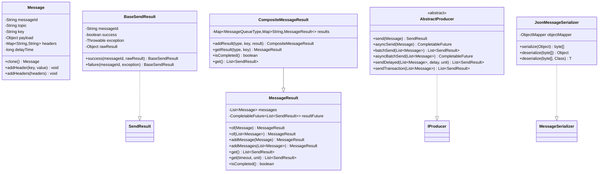
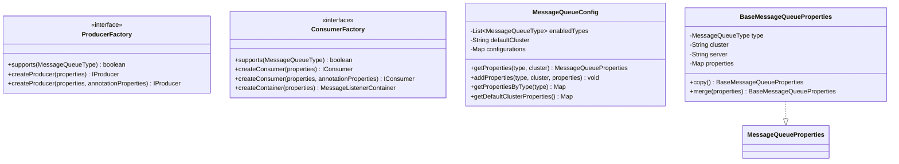
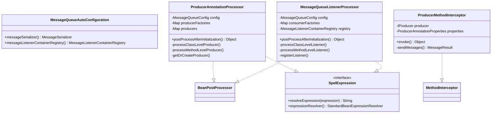
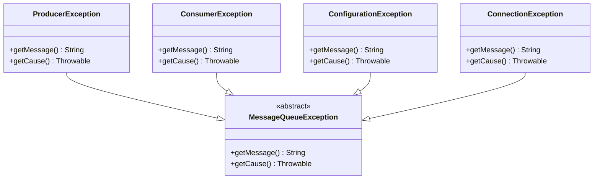

# 消息队列项目类图

## 核心接口类图

```mermaid
classDiagram
    %% 核心接口
    class IProducer {
        <<interface>>
        +send(Message, timeout) SendResult
        +asyncSend(Message, timeout) CompletableFuture
        +batchSend(List~Message~, timeout) List~SendResult~
        +asyncBatchSend(List~Message~, timeout) CompletableFuture
        +sendDelayed(List~Message~, delay, unit, timeout) List~SendResult~
        +sendTransaction(List~Message~, timeout) List~SendResult~
        +close() void
    }
    
    class IConsumer {
        <<interface>>
        +subscribe(topic, consumerGroup) void
        +unsubscribe(topic) void
        +pause() void
        +resume() void
        +close() void
    }
    
    class MessageListener {
        <<interface>>
        +onMessage(Message, ConsumeContext) ConsumeResult
    }
    
    class SendResult {
        <<interface>>
        +getMessageId() String
        +isSuccess() boolean
        +getException() Throwable
        +getRawResult() Object
    }
    
    class MessageQueueProperties {
        <<interface>>
        +getType() MessageQueueType
        +getCluster() String
        +getServer() String
        +getProperties() Map
    }
    
    class MessageSerializer {
        <<interface>>
        +serialize(Object) byte[]
        +deserialize(byte[]) Object
        +deserialize(byte[], Class) T
    }
    
    class MessageConverter {
        <<interface>>
        +toMQMessage(Message) T
        +fromMQMessage(T) Message
    }
```

## 核心类图

```mermaid
classDiagram
    %% 核心类
    class Message {
        -String messageId
        -String topic
        -String key
        -Object payload
        -Map~String,String~ headers
        -long delayTime
        +clone() Message
        +addHeader(key, value) void
        +addHeaders(headers) void
    }
    
    class BaseSendResult {
        -String messageId
        -boolean success
        -Throwable exception
        -Object rawResult
        +success(messageId, rawResult) BaseSendResult
        +failure(messageId, exception) BaseSendResult
    }
    
    class MessageResult {
        -List~Message~ messages
        -CompletableFuture~List~SendResult~~ resultFuture
        +of(Message) MessageResult
        +of(List~Message~) MessageResult
        +addMessage(Message) MessageResult
        +addMessages(List~Message~) MessageResult
        +get() List~SendResult~
        +get(timeout, unit) List~SendResult~
        +isCompleted() boolean
    }
    
    class CompositeMessageResult {
        -Map~MessageQueueType,Map~String,MessageResult~~ results
        +addResult(type, key, result) CompositeMessageResult
        +getResult(type, key) MessageResult
        +isCompleted() boolean
        +get() List~SendResult~
    }
    
    class AbstractProducer {
        <<abstract>>
        +send(Message) SendResult
        +asyncSend(Message) CompletableFuture
        +batchSend(List~Message~) List~SendResult~
        +asyncBatchSend(List~Message~) CompletableFuture
        +sendDelayed(List~Message~, delay, unit) List~SendResult~
        +sendTransaction(List~Message~) List~SendResult~
    }
    
    class JsonMessageSerializer {
        -ObjectMapper objectMapper
        +serialize(Object) byte[]
        +deserialize(byte[]) Object
        +deserialize(byte[], Class) T
    }
    
    %% 关系
    AbstractProducer ..|> IProducer
    BaseSendResult ..|> SendResult
    CompositeMessageResult --|> MessageResult
    JsonMessageSerializer ..|> MessageSerializer
```

## 工厂和配置类图

```mermaid
classDiagram
    %% 工厂接口
    class ProducerFactory {
        <<interface>>
        +supports(MessageQueueType) boolean
        +createProducer(properties) IProducer
        +createProducer(properties, annotationProperties) IProducer
    }
    
    class ConsumerFactory {
        <<interface>>
        +supports(MessageQueueType) boolean
        +createConsumer(properties) IConsumer
        +createConsumer(properties, annotationProperties) IConsumer
        +createContainer(properties) MessageListenerContainer
    }
    
    %% 配置类
    class MessageQueueConfig {
        -List~MessageQueueType~ enabledTypes
        -String defaultCluster
        -Map configurations
        +getProperties(type, cluster) MessageQueueProperties
        +addProperties(type, cluster, properties) void
        +getPropertiesByType(type) Map
        +getDefaultClusterProperties() Map
    }
    
    class BaseMessageQueueProperties {
        -MessageQueueType type
        -String cluster
        -String server
        -Map properties
        +copy() BaseMessageQueueProperties
        +merge(properties) BaseMessageQueueProperties
    }
    
    %% 关系
    BaseMessageQueueProperties ..|> MessageQueueProperties
```

## 注解和容器类图

```mermaid
classDiagram
    %% 注解类
    class Producer {
        <<annotation>>
        +type() MessageQueueType
        +cluster() String
        +topic() String
        +key() String
        +async() boolean
        +sequence() boolean
        +transactionId() String
        +delayTime() long
        +delayUnit() TimeUnit
        +timeout() long
        +properties() String[]
    }
    
    class MessageQueueListener {
        <<annotation>>
        +type() MessageQueueType
        +cluster() String
        +topic() String
        +group() String
        +concurrency() int
        +sequence() boolean
        +transaction() boolean
        +delayQueue() boolean
        +properties() String[]
    }
    
    class ProducerAnnotationProperties {
        -MessageQueueType type
        -String cluster
        -String topic
        -String key
        -boolean async
        -boolean sequence
        -String transactionId
        -long delayTime
        -TimeUnit delayUnit
        -long timeout
        -Map properties
    }
    
    class ConsumerAnnotationProperties {
        -MessageQueueType type
        -String cluster
        -String topic
        -String group
        -int concurrency
        -boolean sequence
        -boolean transaction
        -boolean delayQueue
        -Map properties
    }
    
    %% 容器类
    class MessageListenerContainer {
        <<abstract>>
        #IConsumer consumer
        #MessageListener listener
        #Properties properties
        +start() void
        +stop() void
        #doStart() void
        #doStop() void
        +setupMessageListener() void
    }
    
    class MessageListenerContainerRegistry {
        -Map containers
        +registerContainer() void
        +getContainer() MessageListenerContainer
        +startAll() void
        +stopAll() void
    }
```

## Spring Starter类图

```mermaid
classDiagram
    %% 配置类
    class MessageQueueAutoConfiguration {
        +messageSerializer() MessageSerializer
        +messageListenerContainerRegistry() MessageListenerContainerRegistry
    }
    
    %% 注解处理器
    class ProducerAnnotationProcessor {
        -MessageQueueConfig config
        -Map producerFactories
        -Map producers
        +postProcessAfterInitialization() Object
        -processClassLevelProducer()
        -processMethodLevelProducer()
        -getOrCreateProducer()
    }
    
    class MessageQueueListenerProcessor {
        -MessageQueueConfig config
        -Map consumerFactories
        -MessageListenerContainerRegistry registry
        +postProcessAfterInitialization() Object
        -processClassLevelListener()
        -processMethodLevelListener()
        -registerListener()
    }
    
    class ProducerMethodInterceptor {
        -IProducer producer
        -ProducerAnnotationProperties properties
        +invoke() Object
        -sendMessages() MessageResult
    }
    
    class SpelExpression {
        <<interface>>
        +resolveExpression(expression) String
        +expressionResolver() StandardBeanExpressionResolver
    }
    
    %% 关系
    ProducerAnnotationProcessor ..|> BeanPostProcessor
    ProducerAnnotationProcessor ..|> SpelExpression
    MessageQueueListenerProcessor ..|> BeanPostProcessor
    MessageQueueListenerProcessor ..|> SpelExpression
    ProducerMethodInterceptor ..|> MethodInterceptor
```

## 异常类图

```mermaid
classDiagram
    %% 异常类
    class MessageQueueException {
        <<abstract>>
        +getMessage() String
        +getCause() Throwable
    }
    
    class ProducerException {
        +getMessage() String
        +getCause() Throwable
    }
    
    class ConsumerException {
        +getMessage() String
        +getCause() Throwable
    }
    
    class ConfigurationException {
        +getMessage() String
        +getCause() Throwable
    }
    
    class ConnectionException {
        +getMessage() String
        +getCause() Throwable
    }
    
    %% 关系
    ProducerException --|> MessageQueueException
    ConsumerException --|> MessageQueueException
    ConfigurationException --|> MessageQueueException
    ConnectionException --|> MessageQueueException
```

## 实现模块类图

```mermaid
classDiagram
    %% Kafka实现
    class KafkaProducer {
        -KafkaTemplate template
        -KafkaMessageConverter converter
        +send() SendResult
        +asyncSend() CompletableFuture
        +batchSend() List~SendResult~
    }
    
    class KafkaConsumer {
        -KafkaMessageListenerContainer container
        -KafkaMessageConverter converter
        +subscribe() void
        +unsubscribe() void
    }
    
    class KafkaMessageConverter {
        +toMQMessage() Object
        +fromMQMessage() Message
    }
    
    %% RocketMQ实现
    class RocketMQProducer {
        -DefaultMQProducer producer
        -RocketMQMessageConverter converter
        +send() SendResult
        +asyncSend() CompletableFuture
        +sendDelayed() SendResult
    }
    
    class RocketMQConsumer {
        -DefaultMQPushConsumer consumer
        -RocketMQMessageConverter converter
        +subscribe() void
        +unsubscribe() void
    }
    
    class RocketMQMessageConverter {
        +toMQMessage() Object
        +fromMQMessage() Message
    }
    
    %% RabbitMQ实现
    class RabbitMQProducer {
        -RabbitTemplate template
        -RabbitMessageConverter converter
        +send() SendResult
        +asyncSend() CompletableFuture
        +batchSend() List~SendResult~
    }
    
    class RabbitMQConsumer {
        -SimpleMessageListenerContainer container
        -RabbitMessageConverter converter
        +subscribe() void
        +unsubscribe() void
    }
    
    class RabbitMessageConverter {
        +toMQMessage() Object
        +fromMQMessage() Message
    }
    
    %% Pulsar实现
    class PulsarProducer {
        -Producer producer
        -PulsarMessageConverter converter
        +send() SendResult
        +asyncSend() CompletableFuture
        +sendDelayed() SendResult
    }
    
    class PulsarConsumer {
        -Consumer consumer
        -PulsarMessageConverter converter
        +subscribe() void
        +unsubscribe() void
    }
    
    class PulsarMessageConverter {
        +toMQMessage() Object
        +fromMQMessage() Message
    }
    
    %% 实现关系
    KafkaProducer ..|> IProducer
    KafkaConsumer ..|> IConsumer
    RocketMQProducer ..|> IProducer
    RocketMQConsumer ..|> IConsumer
    RabbitMQProducer ..|> IProducer
    RabbitMQConsumer ..|> IConsumer
    PulsarProducer ..|> IProducer
    PulsarConsumer ..|> IConsumer
    KafkaMessageConverter ..|> MessageConverter
    RocketMQMessageConverter ..|> MessageConverter
    RabbitMessageConverter ..|> MessageConverter
    PulsarMessageConverter ..|> MessageConverter
```

## 总体类关系图

```mermaid
classDiagram
    %% 核心接口和抽象类
    class IProducer {<<interface>>}
    class IConsumer {<<interface>>}
    class MessageListener {<<interface>>}
    class MessageConverter {<<interface>>}
    class MessageSerializer {<<interface>>}
    class SendResult {<<interface>>}
    class MessageQueueProperties {<<interface>>}
    class AbstractProducer {<<abstract>>}
    
    %% 工厂接口
    class ProducerFactory {<<interface>>}
    class ConsumerFactory {<<interface>>}
    
    %% Spring相关接口
    class BeanPostProcessor {<<interface>>}
    class MethodInterceptor {<<interface>>}
    class SpelExpression {<<interface>>}
    
    %% 核心类
    class Message
    class MessageResult
    class CompositeMessageResult
    class BaseSendResult
    class MessageQueueConfig
    class BaseMessageQueueProperties
    class MessageListenerContainer {<<abstract>>}
    class MessageListenerContainerRegistry
    
    %% 注解处理器
    class ProducerAnnotationProcessor
    class MessageQueueListenerProcessor
    class ProducerMethodInterceptor
    
    %% 注解和属性类
    class Producer {<<annotation>>}
    class MessageQueueListener {<<annotation>>}
    class ProducerAnnotationProperties
    class ConsumerAnnotationProperties
    
    %% 异常类
    class MessageQueueException {<<abstract>>}
    class ProducerException
    class ConsumerException
    class ConfigurationException
    class ConnectionException
    
    %% 实现类
    class JsonMessageSerializer
    class KafkaProducer
    class KafkaConsumer
    class RocketMQProducer
    class RocketMQConsumer
    class RabbitMQProducer
    class RabbitMQConsumer
    class PulsarProducer
    class PulsarConsumer
    
    %% 接口实现关系
    AbstractProducer ..|> IProducer
    KafkaProducer ..|> IProducer
    RocketMQProducer ..|> IProducer
    RabbitMQProducer ..|> IProducer
    PulsarProducer ..|> IProducer
    
    KafkaConsumer ..|> IConsumer
    RocketMQConsumer ..|> IConsumer
    RabbitMQConsumer ..|> IConsumer
    PulsarConsumer ..|> IConsumer
    
    JsonMessageSerializer ..|> MessageSerializer
    BaseMessageQueueProperties ..|> MessageQueueProperties
    BaseSendResult ..|> SendResult
    
    %% 继承关系
    CompositeMessageResult --|> MessageResult
    ProducerException --|> MessageQueueException
    ConsumerException --|> MessageQueueException
    ConfigurationException --|> MessageQueueException
    ConnectionException --|> MessageQueueException
    
    %% Spring相关关系
    ProducerAnnotationProcessor ..|> BeanPostProcessor
    ProducerAnnotationProcessor ..|> SpelExpression
    MessageQueueListenerProcessor ..|> BeanPostProcessor
    MessageQueueListenerProcessor ..|> SpelExpression
    ProducerMethodInterceptor ..|> MethodInterceptor
    
    %% 组合和依赖关系
    MessageQueueConfig --> BaseMessageQueueProperties
    MessageListenerContainer --> IConsumer
    MessageListenerContainer --> MessageListener
    MessageListenerContainerRegistry --> MessageListenerContainer
    
    ProducerAnnotationProcessor --> ProducerFactory
    ProducerAnnotationProcessor --> IProducer
    ProducerAnnotationProcessor --> MessageQueueConfig
    
    MessageQueueListenerProcessor --> ConsumerFactory
    MessageQueueListenerProcessor --> MessageListenerContainerRegistry
    MessageQueueListenerProcessor --> MessageQueueConfig
    
    ProducerMethodInterceptor --> IProducer
    ProducerMethodInterceptor --> ProducerAnnotationProperties
    
    KafkaProducer --> MessageConverter
    RocketMQProducer --> MessageConverter
    RabbitMQProducer --> MessageConverter
    PulsarProducer --> MessageConverter
    
    KafkaConsumer --> MessageConverter
    RocketMQConsumer --> MessageConverter
    RabbitMQConsumer --> MessageConverter
    PulsarConsumer --> MessageConverter
``` 